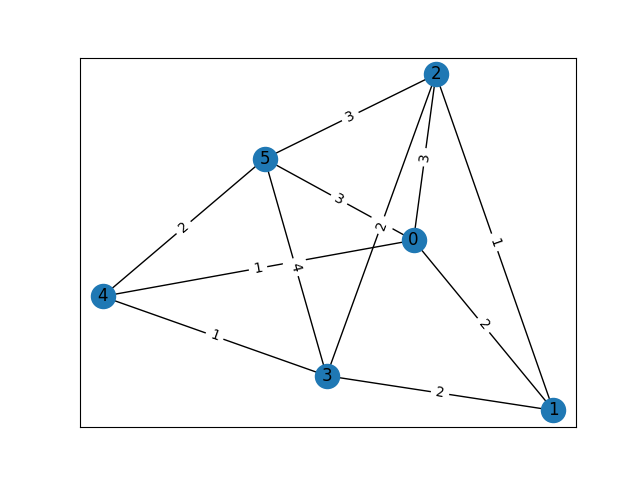
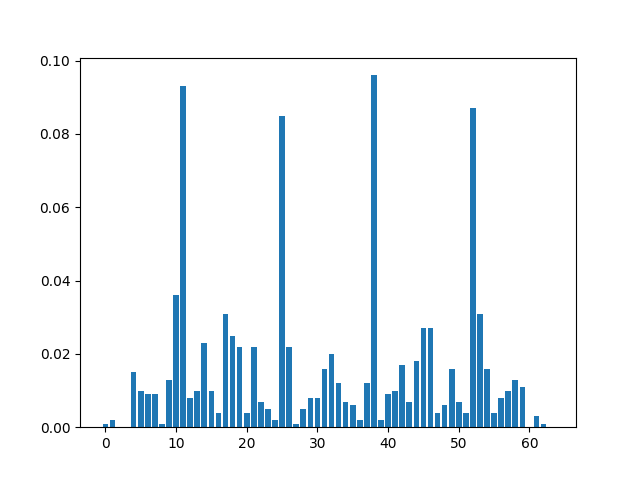
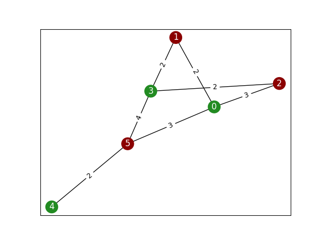
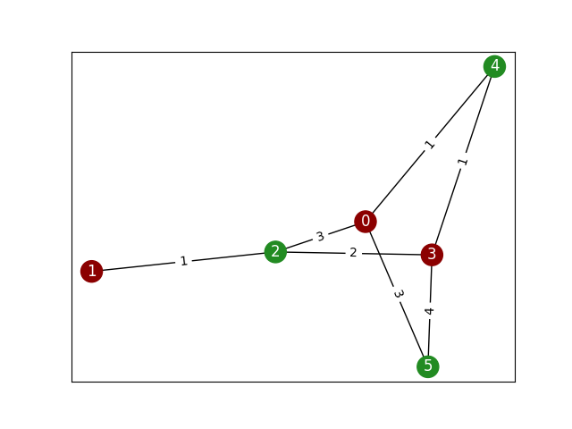

# qosf-tasks

## Deadline
Since I registered on Jan 29, 2021, 5:17 PM IRST, my deadline will be Feb. 12th at 11:59 IRST.

## Task Description:
I chose the 4th task (QAOA). The graph that I have chosen as the static one is taken from [this page](https://tc3-japan.github.io/DA_tutorial/tutorial-3-max-cut.html), but by default it uses a random graph which is generated at the start.
After running the code with `py main.py`, it first shows you an initial drawing of the graph, then, after a few seconds, shows a bar chart of the probabilites of the answers that it has found, and finally, for the two answers with the highest probabilities, shows the edges between the two subgraphs that it has produced. (Doesn't show the edges within each subgraph.)

## Note for the Reviewers:
I know this is mostly based on the intiial code that you gave us, I didn't reimplement the code (that might have been expected), instead, what I tried to do here was improve the code, especially in the places where I thought the code could use some improvements or extra features. (e.g. fixing the part where the result of the quantum circuit was converted to a string and then a 2-d array was made out of it, which was super inefficient!)

## Sample Output:

### Initial Graph Visualization:

### Bar chart of Probabilities

### Cut visualization for cut size: 18

### Cut visualization for cut size: 15

